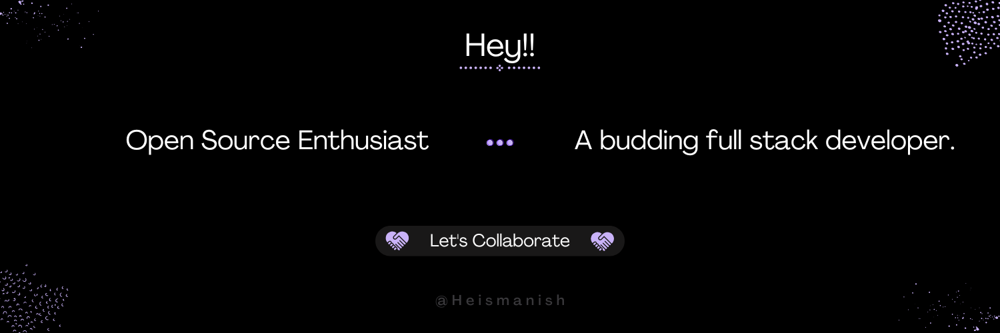

<h1 align=center> Hi 👋, I'm Manish!</h1>

&nbsp

<h3 align=center> <b> A geek making his way in tech while documenting his learnings.</b> </h3>

---

<!--gif-->

&nbsp

<!-- Links -->

<!--About-->

  <li> 😄 Pronouns: He/Him </li>
  <li> 🌱 I’m currently learning FrontEnd.</li>
  <li> 🫰 An open source enthusiast.</li>
  <li> 🧭 Exploring DevRel.</li>
  <li> 👯 I’m looking to collaborate in open source projects.</li>
  <li> <a href= "https://linktr.ee/heismanish">📫 Let's connect.</a> </li>
  
&nbsp

## ⚡ Technologies

### Language :

<!--  -->
<!--  -->
<!--  -->

### Libraries & Framework :

<!-- 

 -->

### Tools:

<!--  -->
<!--  -->
<!--  -->
<!--  -->
<!-- 
 -->
<!--  -->
<!--  -->

---

<!--widgets-->

&nbsp

<!-- Github-stats -->

       
<!-- language stats        -->
<!--  

 -->

<!-- streak stats -->
<!-- 
 -->

&nbsp

